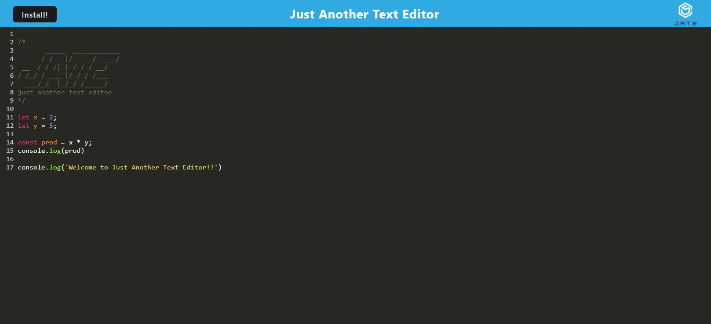

  # JATE - Just Another Text Editor

  ## Description

   JATE (Just Another Text Editor) is a browser based text editor powered by CodeMirror and Workbox. It is a PWA and available for offline use or even download and installation. It is set to highlight JavaScript functioning so that you can work on your code anywhere, even if your internet connection goes out. To this end, workbox service workers are used to cache files and IndexedDB is used to store and retrieve the data. Code is life and this is one more way to improve your life.

  ## Table of Contents 

  - [Installation](#installation)
  - [Usage](#usage)
  - [License](#license)

  ## Installation
  
  First, clone down the repo. Then open a terminal for each of the package.json's and use `npm i` to install the dependencies. Once you have installed all of the dependencies, navigate open a terminal for the root and use to terminal to call `npm run build`. Once built, you will see a dist folder in the client directory. Lastly, call `npm run start:dev` to start the servers. 
  
  ## Usage

  To use the application use `npm run seed` to seed the database and then `npm run server` to start the server. Then use an API client like Insomnia or Postman for CRUD operations. 

  For the deployed application [click here.](https://just-another-text-editor-jate.herokuapp.com/)

  

  ## License

  
   
  
  [Click here for more information regarding the above license](https://opensource.org/licenses/MIT)
    
  ---
    
  ## Technologies

  - node.js
  - webpack
  - workbox
  - IndexedDB
  - babel
  - CodeMirror

  ## How to Contribute

  

  [Find the covenant here](https://www.contributor-covenant.org/version/2/1/code_of_conduct/code_of_conduct.txt)
  
  ## Tests

  Testing has not yet been performed on this application.

  ## Questions
  
  If you have any questions contact the creator at:
   
  [willwneal@gmail.com](mailto:willwneal@gmail.com)
   
  [GitHub](https://github.com/Will-Neal)

